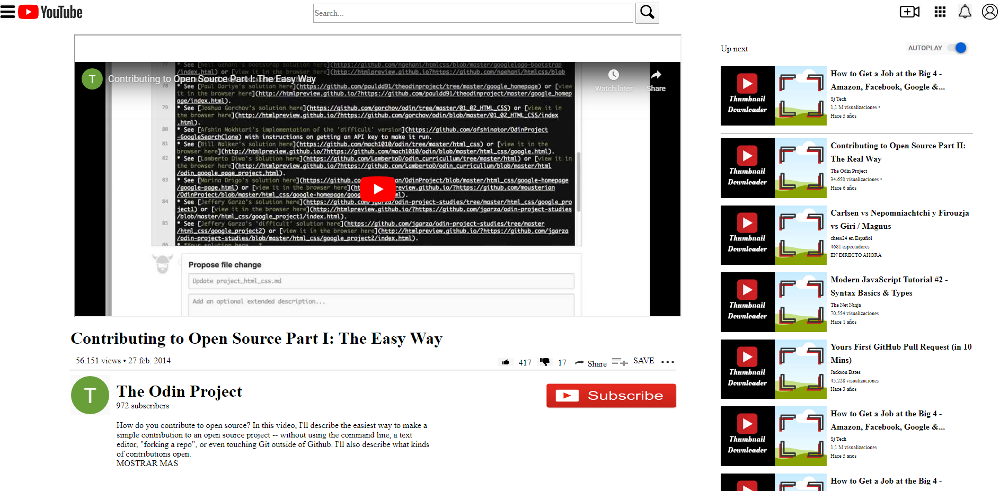

# youtube-page

> In this project, we built a clone of the youtube page. We had to embed a video and a sidebar with video recommendations with embedded images.

The project is a responsive webpage, the video recommendation sidebar will jump to the bottom of the video description section after the threshold of 1400px width is reached, otherwise it should be displayed at the right of the webpage.

## Built With

- HTML5
- CSS3

## Authors

👤 **Author1**

- Github: [@yahir91](https://github.com/yahir91)
- Twitter: [@YahirCardona3](https://twitter.com/YahirCardona3)
- Linkedin: [linkedin](https://www.linkedin.com/in/osmar-yahir-cardona-reyes-54b40b1a7/)

👤 **Author2**

- Github: [@e71az](https://github.com/e71az)
- Twitter: [@e71az](https://twitter.com/e71az)
- Linkedin: [linkedin](https://www.linkedin.com/in/elias-casta%C3%B1eda-17a771115/)

## 🤝 Contributing

Contributions, issues and feature requests are welcome!

Feel free to check the [issues page](https://github.com/yahir91/youtube-page/issues).

## Show your support

Give a ⭐️ if you like this project!

## 📝 License

This project is [MIT](lic.url) licensed.
